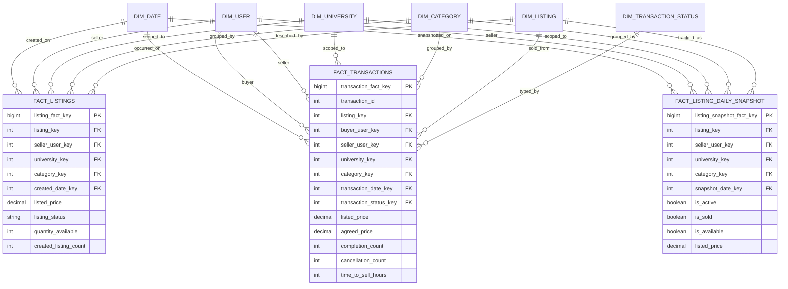
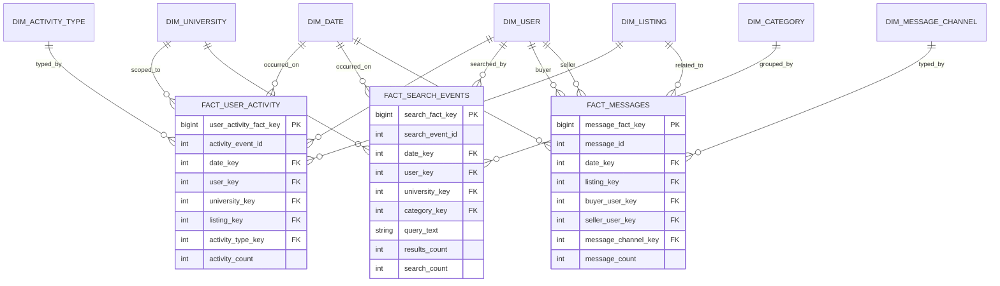
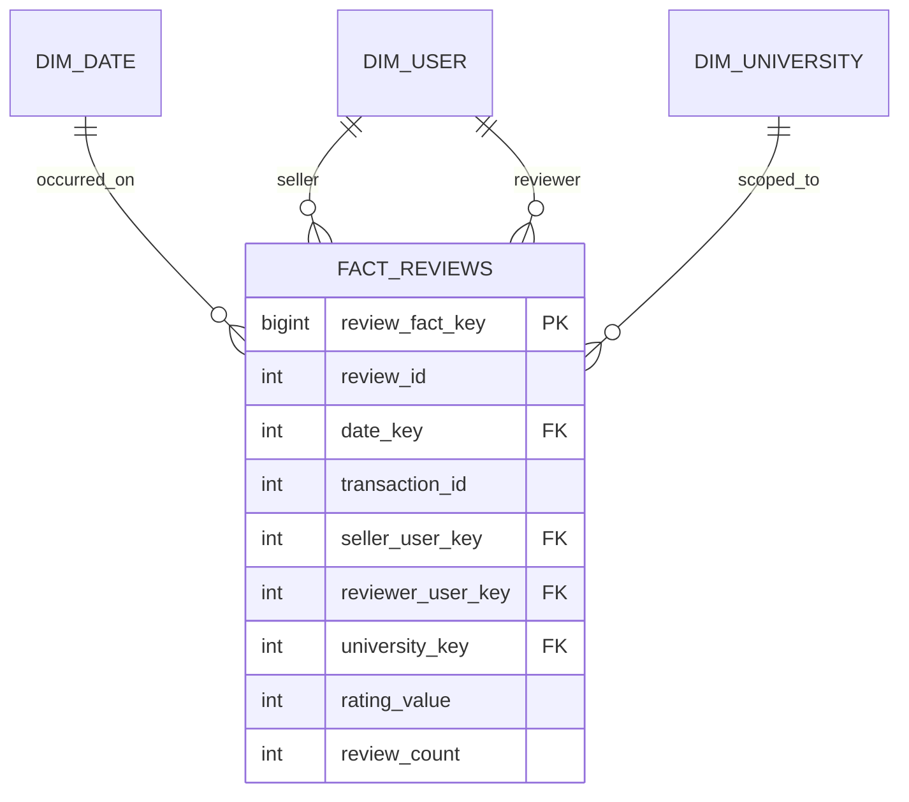
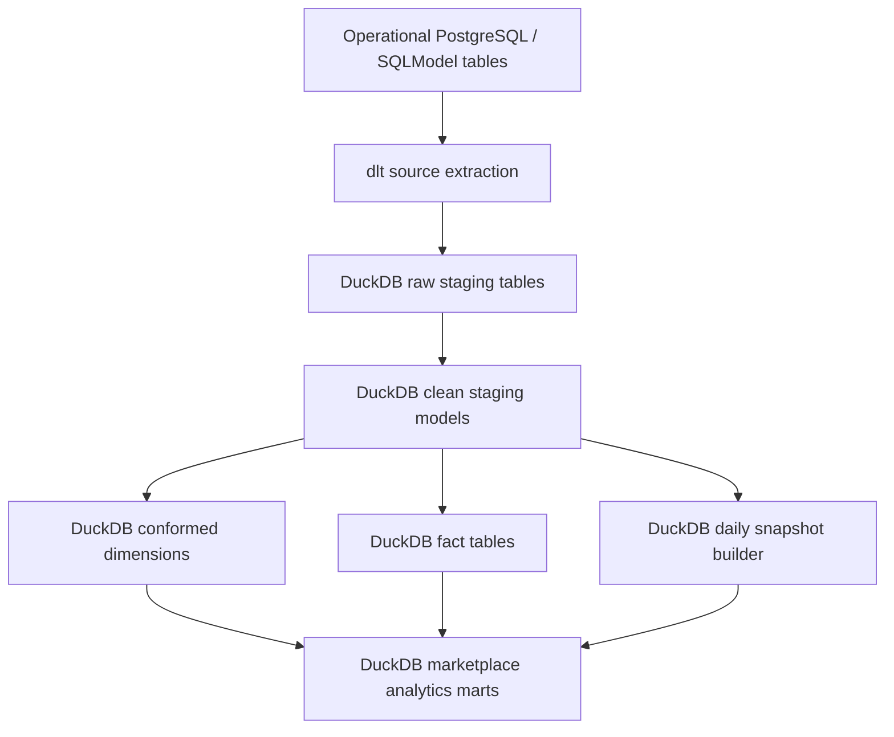

# Marketplace Andes Analytics Star Model

This document proposes the analytical warehouse design needed to answer the questions in `docs/ANALYTICS.md`, along with a concise `dlt` extraction outline from the operational marketplace database into `DuckDB`.

## Design approach

The analytical requirements span multiple behaviors:

- marketplace performance
- listing lifecycle
- user activity
- search demand
- messaging and trust

A single fact table would not model these metrics cleanly, so the warehouse should use a small constellation of star schemas that share conformed dimensions.

In this design, `dlt` lands raw and curated analytical tables in `DuckDB`, which then serves as the local analytical warehouse and query engine for the star models below.

## Metric-to-model mapping

| Analytics question | Primary fact table(s) | Key dimensions |
| --- | --- | --- |
| GMV | `fact_transactions` | date, listing, buyer, seller, category, university |
| Conversion rate | `fact_listings`, `fact_transactions` | date, listing, category, seller |
| Average time to sell | `fact_transactions` + listing lifecycle fields | date, listing, category, seller |
| Active listings per day | `fact_listing_daily_snapshot` | date, listing, category, seller |
| DAU / MAU | `fact_user_activity` | date, user, university, activity type |
| Listings per user | `fact_listings` | date, seller, category, university |
| Buyer vs seller ratio | `fact_transactions`, `fact_listings` | date, buyer, seller, university |
| Listings created vs sold per category | `fact_listings`, `fact_transactions` | date, category |
| Most searched categories | `fact_search_events` | date, user, category, university |
| Price distribution | `fact_listings` | date, category, condition |
| Average rating per seller | `fact_reviews` | date, seller, reviewer, university |
| Cancel rate | `fact_transactions` | date, seller, buyer, category |
| Message-to-sale ratio | `fact_messages`, `fact_transactions` | date, listing, buyer, seller |

## Conformed dimensions

```mermaid
erDiagram
    DIM_DATE {
        int date_key PK
        date full_date
        int year
        int quarter
        int month
        int day
        int weekday
        boolean is_weekend
    }

    DIM_UNIVERSITY {
        int university_key PK
        int university_id
        string name
        string country
        string city
    }

    DIM_PROGRAM {
        int program_key PK
        int program_id
        int university_id
        string name
        string faculty
    }

    DIM_USER {
        int user_key PK
        int user_id
        int university_id
        int program_id
        string email_domain
        boolean is_verified
        date user_created_date
        int current_rating
    }

    DIM_CATEGORY {
        int category_key PK
        int category_id
        int parent_category_id
        string category_name
        string parent_category_name
        string category_path
        boolean is_active
    }

    DIM_LISTING {
        int listing_key PK
        int listing_id
        int seller_user_id
        int category_id
        string product_type
        string condition
        boolean is_digital
        boolean is_negotiable
        string campus_pickup_point
        timestamp created_at
        timestamp published_at
    }

    DIM_ACTIVITY_TYPE {
        int activity_type_key PK
        string activity_type
        string activity_group
    }

    DIM_TRANSACTION_STATUS {
        int transaction_status_key PK
        string status
        boolean is_completed
        boolean is_cancelled
    }

    DIM_MESSAGE_CHANNEL {
        int message_channel_key PK
        string channel_name
    }
```

## Star schema 1: marketplace performance and listing lifecycle

## Star schema 2: engagement, search, and messaging

## Star schema 3: trust and quality

## Recommended grain by fact table

- `fact_listings`
  - One row per listing creation.
- `fact_transactions`
  - One row per transaction.
- `fact_listing_daily_snapshot`
  - One row per listing per day.
- `fact_user_activity`
  - One row per user activity event, or pre-aggregated one row per user/date/activity type if needed for scale.
- `fact_search_events`
  - One row per search event.
- `fact_messages`
  - One row per message, or pre-aggregated one row per conversation/date.
- `fact_reviews`
  - One row per review.

## `dlt` extraction outline

### Source tables expected from the operational model

- `user`
- `university`
- `program`
- `category`
- `listing`
- `listing_status_history`
- `transaction`
- `message_thread`
- `message`
- `review`
- `search_event`
- `user_activity_event`

### Target analytical engine

- `dlt` destination: `DuckDB`
- Raw landing layer: DuckDB raw tables loaded directly from operational extracts
- Curated layer: DuckDB tables or views implementing staging, dimensions, facts, and daily snapshots
- Consumption layer: DuckDB SQL queries answering the metrics in `docs/ANALYTICS.md`

### Load pattern

1. Extract operational tables from the application database with `dlt`.
2. Land them as raw staging tables in `DuckDB`.
3. Build cleaned staging models in `DuckDB` with standardized keys and timestamps.
4. Populate dimensions first.
5. Populate facts from staged operational events.
6. Build a daily snapshot process in `DuckDB` for active listing metrics.

### Suggested `dlt` flow

## Transform notes by metric

- `GMV`
  - Sum `fact_transactions.agreed_price` where transaction status is completed.
- `Conversion rate`
  - Divide sold listings from `fact_transactions` by created listings from `fact_listings`.
- `Average time to sell`
  - Compute from `transaction.completed_at` or completed transaction date minus listing created timestamp.
- `Active listings per day`
  - Best served by `fact_listing_daily_snapshot`; avoid recalculating from raw state on every dashboard query.
- `DAU / MAU`
  - Use `fact_user_activity` with deduplication by user/date.
- `Buyer vs seller ratio`
  - Distinct buyers from `fact_transactions` and distinct sellers from `fact_listings`.
- `Most searched categories`
  - Use `fact_search_events`; if category is absent in a search, derive it from filters or map it to an `unknown` bucket.
- `Message-to-sale ratio`
  - Use `fact_messages` joined conceptually with completed transactions for the same listing or buyer-seller thread.

## Gaps between analytics needs and the current backend

The current codebase does not yet implement most of the source entities required by `docs/ANALYTICS.md`. The following sources must exist in the operational database for the warehouse design to work:

- listing lifecycle tables and timestamps
- completed and cancelled transaction states
- search logging
- message logging
- user activity logging for logins and interactions
- reviews tied to transactions

Without these operational sources, the warehouse can still be documented, but the affected metrics cannot be produced reliably.
