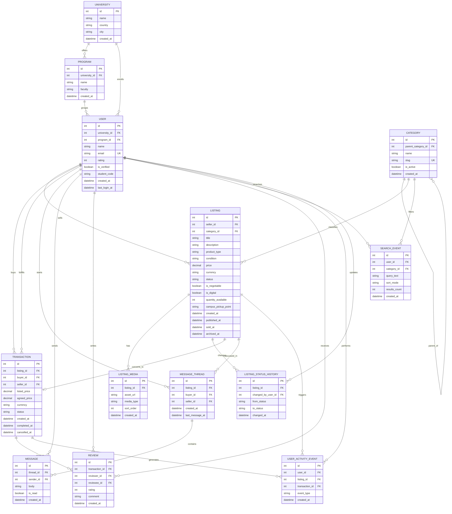

# Marketplace Andes App Database Model

This document proposes the transactional database model for the marketplace application, using the current backend in `src/marketplace_andes_backend` as the starting point.

## Context

- The current backend already defines a minimal `User` model with `id`, `name`, `email`, and `rating`.
- The current app wiring only exposes `users` routes; marketplace domains such as listings and transactions are still missing.
- This model extends the current structure into a university-focused marketplace for students selling physical items and digital materials such as notes.

## Core assumptions

- Each listing has one seller.
- Buyers purchase listings directly; no auction model is included.
- Listings may represent physical goods or digital goods.
- Listing condition is limited to `new`, `used`, and `refurbished`.
- Analytics requirements imply operational tables for messages, searches, reviews, listing lifecycle, and user activity.

## Proposed transactional ER model

## Entity responsibilities

- `USER`
  - Reuses the current backend user concept.
  - Adds university context and verification fields needed for trust and analytics.
- `UNIVERSITY` and `PROGRAM`
  - Support a student-centered marketplace and enable analytical cuts by campus or program.
- `CATEGORY`
  - Supports supply/demand and search analytics, with optional hierarchy.
- `LISTING`
  - Central sellable entity for items, notes, and other student offerings.
  - Stores listing condition, lifecycle timestamps, and commercial attributes.
- `LISTING_MEDIA`
  - Supports multiple photos or digital asset previews per listing.
- `LISTING_STATUS_HISTORY`
  - Preserves lifecycle events required for active listing calculations and operational auditing.
- `TRANSACTION`
  - Represents the conversion of a listing into an order or sale, including cancellation/completion timestamps.
- `MESSAGE_THREAD` and `MESSAGE`
  - Support buyer-seller conversations and the message-to-sale metric.
- `REVIEW`
  - Supports seller trust and quality analytics.
- `SEARCH_EVENT`
  - Required for most searched categories.
- `USER_ACTIVITY_EVENT`
  - Required for DAU/MAU and broader engagement analytics.

## Notes for implementation in the current backend

- The current codebase only implements `users`, so all marketplace tables except `USER` are proposed additions.
- `TRANSACTION` is named as a business entity here; if it conflicts with framework or database conventions, use a concrete table name such as `marketplace_transaction` or `orders` in implementation.
- `LISTING.sold_at` should be derived from the completed sale event or updated transaction status.
- `USER_ACTIVITY_EVENT.event_type` should at minimum cover `login`, `message`, `listing_created`, and `transaction` to satisfy `docs/ANALYTICS.md`.
